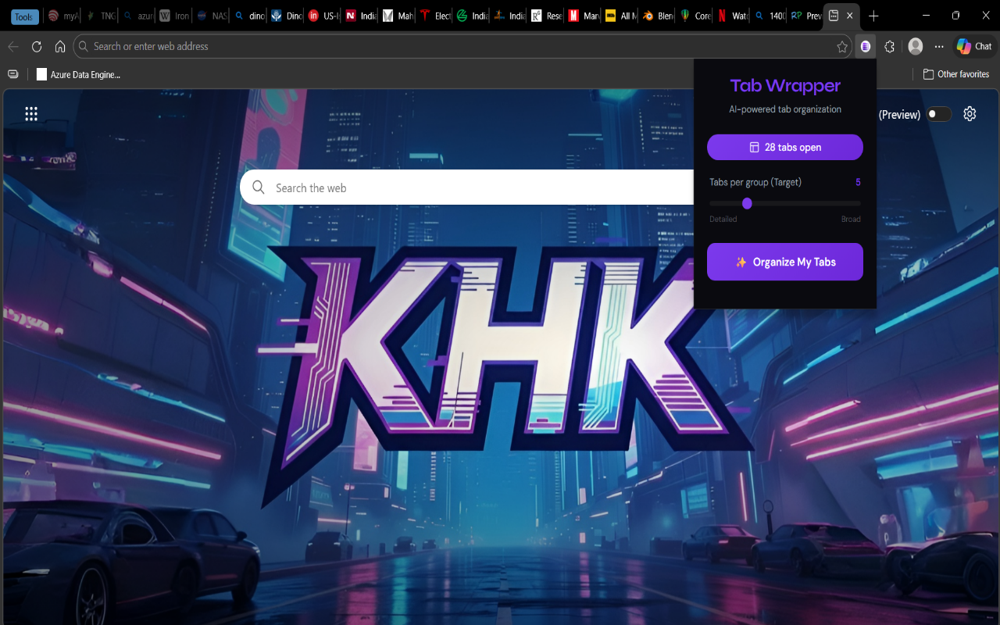
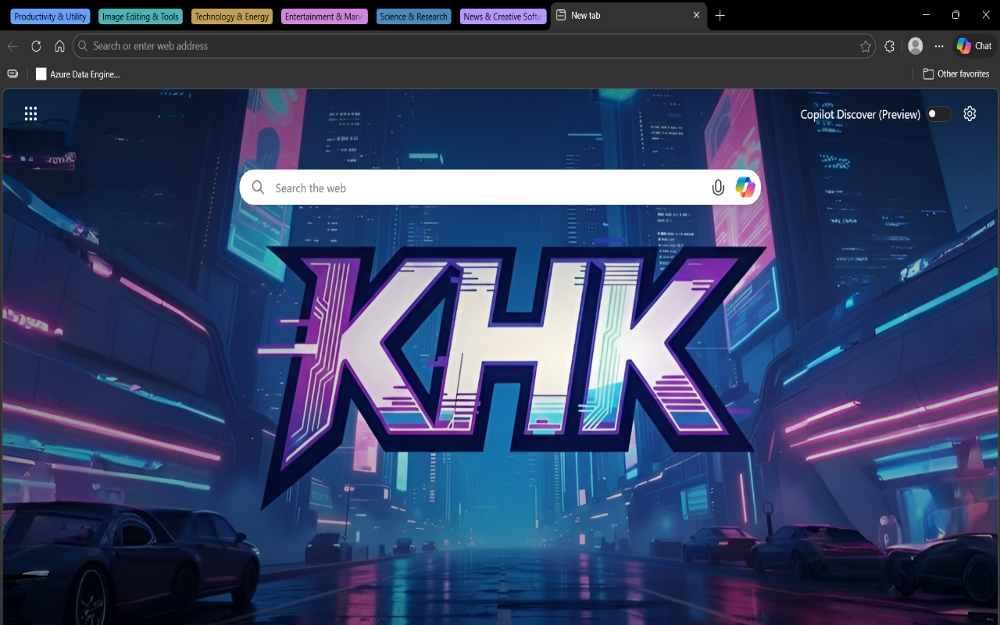

# 📦 Tab Wrapper

**AI-powered tab organization for the modern browser.**

Tab Wrapper is a browser extension that uses advanced AI technology to analyze your open tabs and intelligently categorize them into native, color-coded tab groups with meaningful, context-aware names. Stop drowning in "tab chaos"—let AI declutter your workspace in seconds.

---

## ✨ Visual Walkthrough

### 1. The Chaos Before
Don't waste time manualmente dragging and dropping tabs. Let AI do the work.

### 2. Simple Interface
Trigger the organization process with a single click. 

### 3. AI Categorization
The extension automatically analyzes your tab contents and determines logical categories.

### 4. Perfect Order
Tabs are grouped and labeled by specific context, helping you navigate your browser like a pro.

---

## 🛠️ Features
- **One-Click Organization:** Press the button and watch the magic happen.
- **Smart Categorization:** Analyzes tab titles, URLs, and metadata to infer the "why" behind your tabs.
- **Native Integration:** Creates standard Chrome/Edge tab groups that you can collapse and resize.
- **Privacy First:** Only sends tab metadata (title, URL, and text snippets) to the backend for analysis.

---

## 🏗️ Architecture
The project is built with a decoupled architecture for security and performance:
- **Browser Extension (Frontend):** Vanilla JS, Manifest V3. Collects tab data and communicates with the backend.
- **Vercel Backend (API):** Python (Flask). Securely handles communication with the AI model while keeping API keys hidden from the client side.
- **AI Core:** Powered by the **Gemini 3.1 Flash Lite** model for fast, high-accuracy tab grouping logic.

---

## 🚀 Getting Started

### 1. Installation (Local/Developer Only)
If you want to run the code locally:
1. Clone this repository.
2. Go to `chrome://extensions` or `edge://extensions`.
3. Enable **Developer Mode**.
4. Click **Load unpacked** and select the extension folder.

### 2. Backend Setup
If you want to host your own backend on Vercel:
1. Deploy the `api/` folder to Vercel.
2. Set the following environment variables:
   - `GEMINI_API_KEY`: Your key from [AI Studio](https://aistudio.google.com/app/apikey).
   - `GEMINI_MODEL_ID`: `gemini-3.1-flash-lite-preview`.
3. Update `background.js` to point to your new Vercel URL.

---

## 🎨 Tech Stack
- **Extension:** JavaScript (Manifest V3), HTML, CSS.
- **Backend:** Python, Flask, Vercel Functions.
- **Model:** Google Gemini API.

---

## ⚖️ License
Distributed under the MIT License. See `LICENSE` for more information.

---

## 👤 Author
**Kathari Hima Kishore**  
[Personal Website](http://kathari-hima-kishore.tech/) | [GitHub Profile](https://github.com/Kathari-Hima-Kishore)
